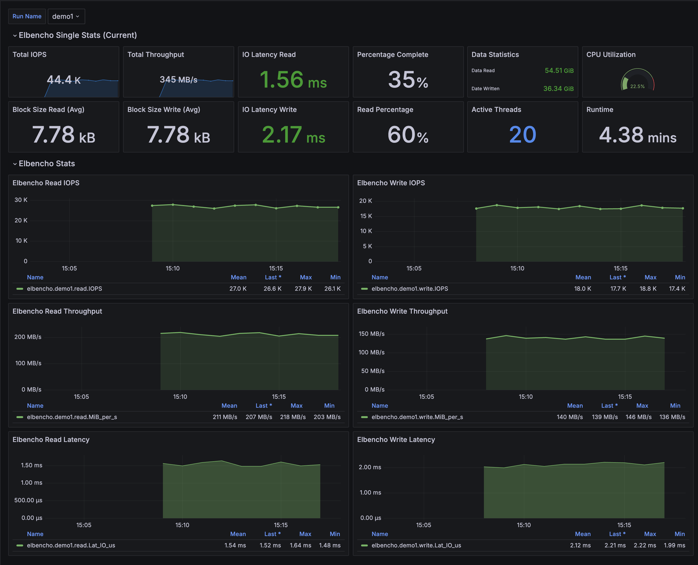

# elbencho_graphite

[Elbencho Repo](https://github.com/breuner/elbencho)

A simple bash script to help graph Elbencho in real-time.  This script parses Elbencho output and feeds it to graphite. Includes an example grafana dashboard that can be tweaked as needed.



## Dependencies

- Ensure that nc (netcat) is installed (for sending data to graphite)
- Elbencho must be configured to output CSV format to stdout via the --livecsv switch (Elbencho v3.0.19 or higher)

## Usage

Simply run Elbencho with the --livecsv switch and pipe to this script.  Optionally you can set --liveint 1000 to receive data every second.  Default it every 2 seconds.

Options

```
Options:
  -s, --server    Set the Graphite server address (default: localhost)
  -p, --port      Set the Graphite port (default: 2003)
  -t, --tag       Set the tag to be used in the metric name (default: default)
  -e, --echo      Echo the data to console (default: disabled)
  -h, --help      Show this help message

```

## Example

elbencho -t 20 --iodepth 4 --write --rwmixpct 60 --direct --block 8k --size 1g /tmp/test{1..256} --livecsv stdout --liveint 1000  | ./elbencho_graphite.sh -s grafana-host -t demo1
